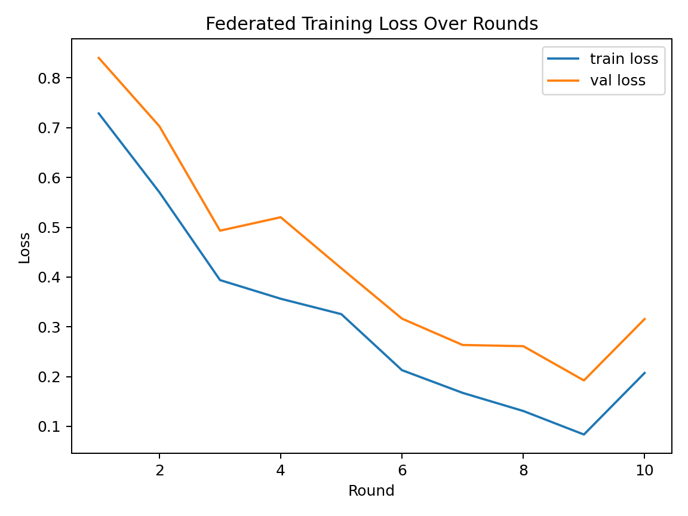
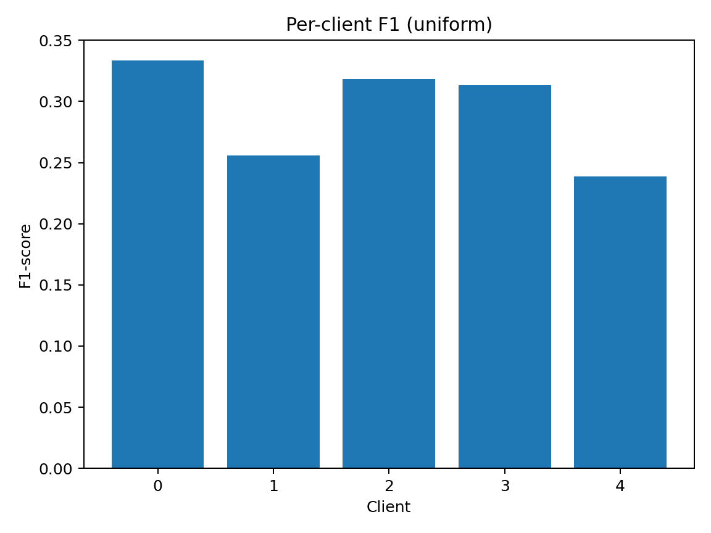

# Federated Fraud Detection (Flower + PyTorch)

[](https://github.com/GAlibrz/federated-fraud-detection/actions/workflows/ci.yml)


Federated learning for detecting payment fraud using **Flower** (FL) and **PyTorch**.  
Process the “Payment Fraud: Empowering Financial Security” dataset (Kaggle), partition it across simulated clients with customizable non‑IID skews, train with **FedAvg**, and evaluate client-level performance.

---

##  Dataset

Data: **Payment Fraud – Empowering Financial Security** (Kaggle, 2023).  
Features include `paymentMethod`, `Category`, behavioral/time features, and a binary target `label` (fraud vs. non‑fraud).

> Place the CSV at `data/raw/payment_fraud.csv`.

---

##  Features

- **Skew-aware partitioning**: `uniform`, `volume` (Dirichlet over volume), `label` (Dirichlet per class), `feature` (Dirichlet over a chosen feature), and optional **combined** skewing.
- **Reproducible preprocessing**: imputation (categorical → "UNKNOWN" / numeric → median), label encoding, standard scaling.
- **Flower simulation** with per‑round logging and **saved global model**.
- **Per‑client evaluation**: Accuracy, Precision, Recall, F1, ROC‑AUC, Confusion Matrix (JSON exports).
- **CLI entry points** (`ff-simulate`, `ff-evaluate`) and clean project layout.
- **Visuals**: learning curves, skew distributions, per‑client F1, confusion matrix.

---

##  Handling Class Imbalance (what this repo does)

Fraud detection is *highly imbalanced*. This code enables multiple, complementary techniques (see `client.py` and `configs/config.yaml`):

1. **Focal Loss** (default): focuses learning on hard/rare positives.  
   - Formula: \(\text{FL}(p_t)=-\alpha(1-p_t)^\gamma\log p_t\)  
   - Tunables: `focal_alpha` (default **0.25**), `focal_gamma` (default **2.0**).

2. **WeightedRandomSampler** in the **training DataLoader**: samples minority class more often based on inverse class frequency estimated on the client's training split.

3. **Label smoothing** (optional): stabilizes training with noisy labels; set `label_smoothing` \(\in [0,1)\).

4. **Threshold tuning** for inference: default `threshold=0.5`, configurable per experiment to trade off precision/recall depending on business cost.

5. **AUC/F1‑centric reporting**: beyond accuracy, we log **F1** and **ROC‑AUC**, which are more informative under imbalance.

> Future extensions you can toggle in roadmap: class‑weighted BCE, PR‑AUC tracking, cost‑sensitive metrics, or focal Tversky for extreme skew.

---

##  Visual Overview

<p align="center">
  

  
</p>

---

##  Quickstart

### 1) Setup
```bash
git clone https://github.com/galibrz/federated-fraud.git
cd federated-fraud
python -m venv .venv && source .venv/bin/activate
pip install -r requirements.txt
```

### 2) Preprocess & Partition
```bash
python -m src.federated_fraud.data configs/config.yaml
```
Generates partitioned client datasets under `data/processed/<skew>/client_{i}.pt`.

### 3) Run Federated Training
```bash
ff-simulate
# or: python cli/simulate.py
```
Saves the final global model to `results/models/<skew>/model_final.pth`.

### 4) Evaluate Per Client
```bash
ff-evaluate
# or: python cli/evaluate.py
```
Exports JSON metrics to `results/metrics/<skew>/fed_per_client/`.

### 5) Generate/Update Visuals
```bash
python scripts/generate_readme_visuals.py
```
Produces: `loss_curve.png`, `f1_per_client.png`, `skew_distribution.png`.  
Add your pipeline diagram as `pipeline.png` (from your presentation or draw.io).

---

##  Configuration (configs/config.yaml)

```yaml
# Repro
seed: 42

# Federated setup
num_clients: 5
rounds: 10

# Data split
test_frac: 0.1
val_frac: 0.1

# Skewing
skew_type: "label"            # uniform | volume | label | feature
combine_skew: false
volume_alpha: 1.0
label_alpha: 0.5
feature_column: "Category"
feature_alpha: 0.5

# Client training
batch_size: 64
local_epochs: 5
lr: 5e-4
weight_decay: 1e-5
scheduler:
  step_size: 5
  gamma: 0.5

# Imbalance knobs
focal_alpha: 0.25
focal_gamma: 2.0
label_smoothing: 0.0

# Inference
threshold: 0.5
```

---

##  Example Results (illustrative)

| Skew     | Accuracy | Precision | Recall | F1   | ROC‑AUC |
|----------|----------|-----------|--------|------|---------|
| uniform  | 0.92     | 0.89      | 0.86   | 0.87 | 0.95    |
| label    | 0.88     | 0.84      | 0.80   | 0.82 | 0.92    |

> Full per-client JSONs at `results/metrics/<skew>/fed_per_client/`.

---

##  Tech Stack

Python (3.10+), PyTorch, Flower, scikit‑learn, Ray, Matplotlib

---

##  Roadmap

- [ ] PR‑AUC & ROC curves per client + threshold sweep
- [ ] Class‑weighted BCE alternative to focal (toggle via config)
- [ ] DP‑SGD or Secure Aggregation variants for privacy
- [ ] Hydra configs for multi‑run experiments
- [ ] Streamlit/HF Space demo for inference

---

##  Citation & License

See `CITATION.cff` for citation details.  
Licensed under **MIT License**.

## ⚖️ Handling Imbalance in Federated Fraud Detection

Fraud detection is an **extremely imbalanced** problem — fraudulent transactions make up only a tiny fraction of real-world data.  
In this project, several advanced techniques are applied to mitigate imbalance and improve minority class detection in a **federated setting**:

- **Focal Loss** – focuses learning on hard, minority samples instead of easy majorities.  
- **Weighted Sampling** – balances the training batches so fraud examples are not ignored.  
- **Label Smoothing** – reduces overconfidence in predictions, making the model more robust.  
- **Threshold Tuning** – dynamically adjusts classification threshold beyond the default 0.5 to maximize F1.  
- **Metrics beyond Accuracy** – reports **F1-score** and **ROC-AUC**, which are much more meaningful for imbalance than accuracy.  
- **Per-client Evaluation** – highlights fairness issues in federated learning: some clients with skewed data distributions may perform worse, a key research challenge.

> 🔎 **Why is F1 relatively low (~0.35)?**  
> This reflects the *inherent difficulty* of imbalanced fraud detection in a federated setup.  
> A naive baseline might achieve F1 < 0.1, while this implementation shows significant improvement using the techniques above.  
> In centralized setups, F1 can reach 0.6–0.7 on this dataset, but federated constraints (non-IID partitions) make the problem much harder — and more realistic.
